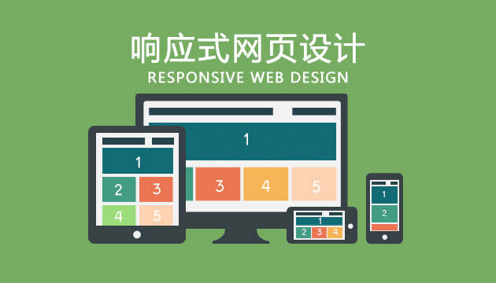

# 响应式网页设计




## 1 什么是响应式设计

### 1.1 定义

伊桑·马科特（Ethan Marcotte）在2010年首先提出了响应式网页设计（RWD,Responsive Web Design）这个术语。在他的一篇文章《Responsive Web Design · An A List Apart Article》中他将已有的三种发开技巧（弹性图片，弹性网格布局，媒体与媒体查询） 进行了整合，命名为响应式网页设计。

那什么才是真正的响应式设计？马科特说，真正的响应式设计方法不仅仅是根据可视区域大小而改变网页布局，而是要从整体上颠覆当前网页的设计方法，是针对任意设备的网页内容进行完美布局的一种显示机制。


### 1.2 响应式设计的优势	

* 开发、维护、运营成本优势：页面只有一个，只是针对不同的分辨率、 不同的设备环境进行了一些不同的设计，所以在开发、维护和运营上， 相对多个版本，能节约成本。
* 兼容性优势：移动设备新的尺寸层出不穷，定制的版本通常只适用于某些规格的设备，如果新的设备分辨率变化较大，则往往不能兼容，而开发新的版本需要时间，这段时间内的访问就是个问题， 但是响应式Web设计可以提前预防这个问题。
* 操作灵活：响应式设计是针对页面的，可以只对必要的页面进行改动，其他页面不受影响。


## 2 屏幕的相关概念

* 分辨率 resolutio		是指显示器所能显示的像素的多少

	 像素密度		单位： dpi（dots per inch）  ppi

  > 像素密度（pixels per inch），也称PPi，即每英寸屏幕所拥有的像素数，像素密度越大，显示画面细节就越丰富。 
  > 像素密度=√{（长度像素数^2+宽度像素数^2）}/ 屏幕尺寸
  >
  > iphone3G 165dpi      320px * 480px;
  > iphone4    326 dpi     640px * 960px
  > iphone6s  326dpi      1334px * 750px	

* 每像素包含点的数量(dppx)	

  > 用 iPhone4 举个例子，它有 326 DPI 显示屏，根据上表，智能手机的典型观看距离大概16.8英寸，基准像素为 160 DPI。所以要显示一个 CSS 像素，苹果选择将像素比设置为2，所以看起来就和 163 DPI 手机中显示的一样了。	

	 设备像素比(dip或dpr)		同 dppx

* 视网膜屏幕	

  > ​        视网膜（Retina）屏幕是苹果公司在部分移动产品使用的一种屏幕。第一次被人们熟知，是苹果将其用在iphone 4手机上，它将960×640的分辨率压缩到一个3.5英寸的显示屏内。也就是说，该屏幕的像素密度达到326像素/英寸（ppi），称之为“视网膜屏幕”。通常电脑显示屏幕的分辨率为72ppi，iPhone 4的分辨率为电脑的4倍多。由于其具备超高像素密度的液晶屏，因此屏幕显示异常清晰、锐利。		

* 常见设备屏幕信息  https://github.com/h5bp/mobile-boilerplate/wiki/Mobile-Matrices


## 3 viewport 视口

### 3.1 什么是viewport

* viewport 是用户网页的可视区域。
* viewport 翻译为中文可以叫做"视区"。
* 手机浏览器是把页面放在一个虚拟的"窗口"（viewport）中，通常这个虚拟的"窗口"（viewport）比屏幕宽，这样就不用把每个网页挤到很小的窗口中（这样会破坏没有针对手机浏览器优化的网页的布局），用户可以通过平移和缩放来看网页的不同部分。

### 3.2 设置viewport

```html
<meta name=”viewport” content=”width=device-width, initial-scale=1, maximum-scale=1″>
```

* width：控制 viewport 的大小，可以指定的一个值，如果 600，或者特殊的值，如 device-width 为设备的宽度（单位为缩放为 100% 时的 CSS 的像素）。
* height：和 width 相对应，指定高度。
* initial-scale：初始缩放比例，也即是当页面第一次 load 的时候缩放比例。
* maximum-scale：允许用户缩放到的最大比例。
* minimum-scale：允许用户缩放到的最小比例。
* user-scalable：用户是否可以手动缩放。


## 4 媒体查询 @media

### 4.1 媒体类型

| 值         | 描述                                                         |
| ---------- | ------------------------------------------------------------ |
| all        | 用于所有设备                                                 |
| aural      | 已废弃。用于语音和声音合成器                                 |
| braille    | 已废弃。 应用于盲文触摸式反馈设备                            |
| embossed   | 已废弃。 用于打印的盲人印刷设备                              |
| handheld   | 已废弃。 用于掌上设备或更小的装置，如PDA和小型电话           |
| print      | 用于打印机和打印预览                                         |
| projection | 已废弃。 用于投影设备                                        |
| screen     | 用于电脑屏幕，平板电脑，智能手机等。                         |
| speech     | 应用于屏幕阅读器等发声设备                                   |
| tty        | 已废弃。 用于固定的字符网格，如电报、终端设备和对字符有限制的便携设备 |
| tv         | 已废弃。 用于电视和网络电视                                  |

### 4.2 媒体特性

* aspect-ratio		可视窗口宽高比   min/max

* device-aspect-ratio	设备的宽高比   min/max

* orientation	设备的使用方向

   > landscape (水平方向)
   >
   > portrait（垂直方向 ）		

* width  可视窗口的宽度   max/min

* device-width  设备的宽度   max/min
   height	可视窗口的高度   max/min

* device-height  设备的高度   max/min

* resolution	屏幕密度 单位dppx   max/min

   > webkit内核请使使用 -webkit-min-device-pixel-ratio	

| 值                      | 描述                                                         |
| ----------------------- | ------------------------------------------------------------ |
| aspect-ratio            | 定义输出设备中的页面可见区域宽度与高度的比率                 |
| color                   | 定义输出设备每一组彩色原件的个数。如果不是彩色设备，则值等于0 |
| color-index             | 定义在输出设备的彩色查询表中的条目数。如果没有使用彩色查询表，则值等于0 |
| device-aspect-ratio     | 定义输出设备的屏幕可见宽度与高度的比率。                     |
| device-height           | 定义输出设备的屏幕可见高度。                                 |
| device-width            | 定义输出设备的屏幕可见宽度。                                 |
| grid                    | 用来查询输出设备是否使用栅格或点阵。                         |
| height                  | 定义输出设备中的页面可见区域高度。                           |
| max-aspect-ratio        | 定义输出设备的屏幕可见宽度与高度的最大比率。                 |
| max-color               | 定义输出设备每一组彩色原件的最大个数。                       |
| max-color-index         | 定义在输出设备的彩色查询表中的最大条目数。                   |
| max-device-aspect-ratio | 定义输出设备的屏幕可见宽度与高度的最大比率。                 |
| max-device-height       | 定义输出设备的屏幕可见的最大高度。                           |
| max-device-width        | 定义输出设备的屏幕最大可见宽度。                             |
| max-height              | 定义输出设备中的页面最大可见区域高度。                       |
| max-monochrome          | 定义在一个单色框架缓冲区中每像素包含的最大单色原件个数。     |
| max-resolution          | 定义设备的最大分辨率。                                       |
| max-width               | 定义输出设备中的页面最大可见区域宽度。                       |
| min-aspect-ratio        | 定义输出设备中的页面可见区域宽度与高度的最小比率。           |
| min-color               | 定义输出设备每一组彩色原件的最小个数。                       |
| min-color-index         | 定义在输出设备的彩色查询表中的最小条目数。                   |
| min-device-aspect-ratio | 定义输出设备的屏幕可见宽度与高度的最小比率。                 |
| min-device-width        | 定义输出设备的屏幕最小可见宽度。                             |
| min-device-height       | 定义输出设备的屏幕的最小可见高度。                           |
| min-height              | 定义输出设备中的页面最小可见区域高度。                       |
| min-monochrome          | 定义在一个单色框架缓冲区中每像素包含的最小单色原件个数       |
| min-resolution          | 定义设备的最小分辨率。                                       |
| min-width               | 定义输出设备中的页面最小可见区域宽度。                       |
| monochrome              | 定义在一个单色框架缓冲区中每像素包含的单色原件个数。如果不是单色设备，则值等于0 |
| orientation             | 定义输出设备中的页面可见区域高度是否大于或等于宽度。         |
| resolution              | 定义设备的分辨率。如：96dpi, 300dpi, 118dpcm                 |
| scan                    | 定义电视类设备的扫描工序。                                   |
| width                   | 定义输出设备中的页面可见区域宽度。                           |

 

###4.3  媒体查询用法

#### 用法一

```html
<link rel="stylesheet" media="mediatype" href="mystylesheet.css">
<link rel="stylesheet" media="mediatype and (media feature)" href="mystylesheet.css">
```

#### 用法二

```css
@import url(css文件) mediaType			
```

#### 用法三

```css
@media mediatype and (media feature) {
    CSS-Code;
}

@media (media feature) {
    CSS-Code;
}
```

### 4.4 媒体查询语法运算符

* `and`  	并且
* `,`	 	或者
* `not`   	否定	一定要指定媒体类型，因为媒体类型默认all，not后永远返回假
* `only`	only + 媒体类型


## 5 断点设置

### 5.1 常用设置一

三个断点： 768px   992px   1200px

* 手机 超小屏幕    <= 768px		
* 平板 小屏幕	   769px ~ 992px	
* 中等屏幕	      993px ~ 1200px	
* 大屏幕	      > 1200px		

### 5.2 常用设置二

四个断点： 576px  768px  992px   1200px

* 超小屏幕	   <=576px
* 小屏幕       577px ~ 768px
* 中等屏幕   769px ~ 992px
* 大屏幕      993px ~ 1200px
* 超大屏幕   >1200px

### 5.3 推荐设置三

两个断点： 640px   1024px

* 小屏幕	<=640px
* 中等屏幕  641px ~ 1024px
* 大屏幕   >1024px


## 6 响应式图片

* 设置图片宽度百分比	

* 使用背景图片

   > paddint-top
   >
   > background-size		

* 使用H5  `<picture>` 标签	

  ```html
  <picture>
  	<source srcset="./images/banner01-small.jpg" media="(max-width:768px)">
  	<source srcset="./images/banner01_middle.jpg" media="(max-width:992px)">
  	<source srcset="./images/banner01.jpg">
  	
  </picture>
  ```

* 使用 picturefill 插件	

  ```html
  <span data-picture data-alt="响应式图片">
  	<span data-src="./images/banner01-small.jpg"></span>
  	<span data-src="./images/banner01_middle.jpg" data-media="(min-width:768px)"></span>
  	<span data-src="./images/banner01.jpg" data-media="(min-width:992px)"></span>
  </span>
  ```


