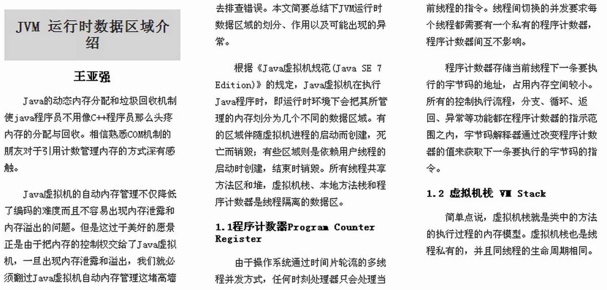
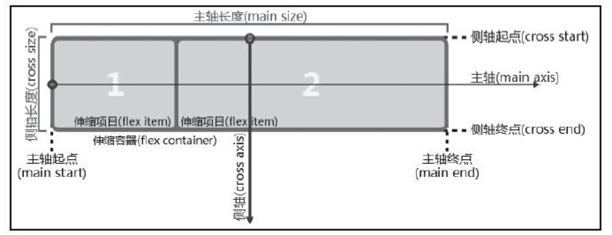
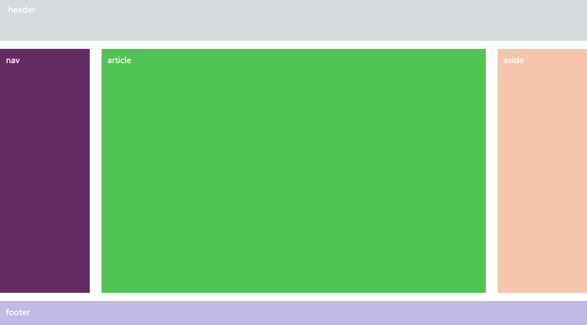

# 新的页面布局方式

## 1 多列布局

### 1.1 多列布局介绍

实现类似于报纸的布局方式

)

### 1.2 多列布局的相关CSS属性

* columns		设置的列数和每列的宽度。复合属性 	

  ```css
  columns：<' column-width '> || <' column-count '>		
  ```
* column-width	设置每列的宽度（类似于最小宽度）	

  > <length>： 用长度值来定义列宽。不允许负值 
  > auto： 根据 <' column-count '> 自定分配宽度	 

* column-count	设置列数

  > <integer>： 用整数值来定义列数。不允许负值 
  > auto： 根据 <' column-width '> 自定分配宽度 				

* column-gap	设置列与列之间的间隙

  > <length>： 用长度值来定义列与列之间的间隙。不允许负值 
  > normal： 与 <' font-size '> 大小相同。假设该对象的font-size为16px，则normal值为16px，类推。 			

* column-rule	 列与列之间的边框,复合属性 同border类似

  ```css
  column-rule：<' column-rule-width '> || <' column-rule-style '> || <' column-rule-color '>
  ```

* column-rule-width	列与列之间的边框厚度		

  > <length>： 用长度值来定义边框的厚度。不允许负值 
  > medium： 定义默认厚度的边框。 
  > thin： 定义比默认厚度细的边框。 
  > thick： 定义比默认厚度粗的边框。 		

* column-rule-style	 列与列之间的边框样式		

  > none： 无轮廓。<' column-rule-color '> 与<' column-rule-width '> 将被忽略 
  > hidden： 隐藏边框。 
  > dotted： 点状轮廓。 
  > dashed： 虚线轮廓。 
  > solid： 实线轮廓 
  > double： 双线轮廓。两条单线与其间隔的和等于指定的 <' column-rule-width '> 值 
  > groove： 3D凹槽轮廓。 
  > ridge： 3D凸槽轮廓。 
  > inset： 3D凹边轮廓。 
  > outset： 3D凸边轮廓。 	

* column-rule-color	列与列之间的边框颜色			

* column-span		对象元素是否横跨所有列

  > none： 不跨列 (默认)
  > all： 横跨所有列 			

* column-fill	所有列的高度是否统一	

  > auto： 列高度自适应内容 (默认)
  > balance： 所有列的高度以其中最高的一列统一 

* column-break-before	 对象之前是否断行

  > auto： 既不强迫也不禁止在元素之前断行并产生新列 (默认)
  > always： 总是在元素之前断行并产生新列 
  > avoid： 避免在元素之前断行并产生新列 			

* column-break-after	对象之后是否断行

  > auto： 既不强迫也不禁止在元素之后断行并产生新列 
  > always： 总是在元素之后断行并产生新列 
  >
  > avoid： 避免在元素之后断行并产生新列 				

* column-break-inside	对象内部是否断行			

  > auto： 既不强迫也不禁止在元素内部断行并产生新列 (默认)
  > avoid： 避免在元素内部断行并产生新列 


## 2 伸缩盒布局(弹性盒模型、FlexBox)

### 2.1 伸缩盒模型的基本知识

#### 弹性盒模型的特点

* 第一，屏幕和浏览器窗口大小发生改变也可以灵活调整布局；
* 第二，可以指定伸缩项目沿着主轴或侧轴按比例分配额外空间（伸缩容器额外空间），从而调整伸缩项目的大小；
* 第三，可以指定伸缩项目沿着主轴或侧轴将伸缩容器额外空间，分配到伸缩项目之前、之后或之间；
* 第四，可以指定如何将垂直于元素布局轴的额外空间分布到该元素的周围；
* 第五，可以控制元素在页面上的布局方向；
* 第六，可以按照不同于文档对象模型（DOM）所指定排序方式对屏幕上的元素重新排序。也就是说可以在浏览器渲染中不
* 照文档流先后顺序重排伸缩项目顺序。

#### 伸缩盒模型中的专业术语



* 主轴和侧轴

  > 主轴 主轴方向		
  > 主轴起点 主轴终点	
  > 主轴长度 主轴长度属性	
  > 侧轴 侧轴方向		
  > 侧轴起点 侧轴终点	
  > 侧轴长度  侧轴长度属性		

* 伸缩容器和伸缩项目	

* 伸缩容器的属性	
  > 伸缩流方向		
  > 伸缩行换行		
  > 伸缩方向与换行		
  > 主轴对齐		
  > 侧轴对齐		
  > 堆栈伸缩行			

* 伸缩项目的属性	
  > 显示顺序		
  > 侧轴对齐		
  > 伸缩性			

* 伸缩行			

  

### 2.2 相关CSS属性

#### 将容器设置为伸缩盒	

```css
display: flex | inline-flew	
```

#### 伸缩流方向	 

* flex-direction	 通过定义flex容器的主轴方向来决定felx子项在flex容器中的位置。这将决定flex需要如何进行排列 

  > 取值
  >
  > row： 主轴与行内轴方向作为默认的书写模式。即横向从左到右排列（左对齐）。 
  > row-reverse： 对齐方式与row相反。 
  > column： 主轴与块轴方向作为默认的书写模式。即纵向从上往下排列（顶对齐）。 
  > column-reverse： 对齐方式与column相反。 	

#### 伸缩换行

* flex-wrap	控制flex容器是单行或者多行，同时横轴的方向决定了新行堆叠的方向

  > nowrap： flex容器为单行。该情况下flex子项可能会溢出容器 (默认)
  > wrap： flex容器为多行。该情况下flex子项溢出的部分会被放置到新行，子项内部会发生断行 
  > wrap-reverse： 反转 wrap 排列。 	

#### 伸缩流方向与换行

* flew-flow	flex-direction 和 flex-wrap 的复合属性		

  ```css
  flex-flow：<' flex-direction '> || <' flex-wrap '>
  ```

#### 主轴对齐

* justify-content		弹性盒子元素在主轴（横轴）方向上的对齐方式

  > 取值
  >
  > flex-start： 弹性盒子元素将向行起始位置对齐。该行的第一个子元素的主起始位置的边界将与该行的主起始位置的边界对齐，同时所有后续的伸缩盒项目与其前一个项目对齐。 
  >
  > flex-end： 弹性盒子元素将向行结束位置对齐。该行的第一个子元素的主结束位置的边界将与该行的主结束位置的边界对齐，同时所有后续的伸缩盒项目与其前一个项目对齐。 
  >
  > center： 弹性盒子元素将向行中间位置对齐。该行的子元素将相互对齐并在行中居中对齐，同时第一个元素与行的主起始位置的边距等同与最后一个元素与行的主结束位置的边距（如果剩余空间是负数，则保持两端相等长度的溢出）。 
  >
  > space-between： 弹性盒子元素会平均地分布在行里。如果最左边的剩余空间是负数，或该行只有一个子元素，则该值等效于'flex-start'。在其它情况下，第一个元素的边界与行的主起始位置的边界对齐，同时最后一个元素的边界与行的主结束位置的边距对齐，而剩余的伸缩盒项目则平均分布，并确保两两之间的空白空间相等。 
  >
  > space-around： 弹性盒子元素会平均地分布在行里，两端保留子元素与子元素之间间距大小的一半。如果最左边的剩余空间是负数，或该行只有一个伸缩盒项目，则该值等效于'center'。在其它情况下，伸缩盒项目则平均分布，并确保两两之间的空白空间相等，同时第一个元素前的空间以及最后一个元素后的空间为其他空白空间的一半。 			

#### 侧轴对齐

* align-content			当伸缩容器的侧轴还有多余空间时，本属性可以用来调准「伸缩行」在伸缩容器里的对齐方式，这与调准伸缩项目在主轴上对齐方式的 <' justify-content '> 属性类似。请注意本属性在只有一行的伸缩容器上没有效果。

  > 取值
  >
  > flex-start： 各行向弹性盒容器的起始位置堆叠。弹性盒容器中第一行的侧轴起始边界紧靠住该弹性盒容器的侧轴起始边界，之后的每一行都紧靠住前面一行。 
  >
  > flex-end： 各行向弹性盒容器的结束位置堆叠。弹性盒容器中最后一行的侧轴起结束界紧靠住该弹性盒容器的侧轴结束边界，之后的每一行都紧靠住前面一行。 
  >
  > center： 各行向弹性盒容器的中间位置堆叠。各行两两紧靠住同时在弹性盒容器中居中对齐，保持弹性盒容器的侧轴起始内容边界和第一行之间的距离与该容器的侧轴结束内容边界与第最后一行之间的距离相等。（如果剩下的空间是负数，则各行会向两个方向溢出的相等距离。） 
  >
  > space-between： 各行在弹性盒容器中平均分布。如果剩余的空间是负数或弹性盒容器中只有一行，该值等效于'flex-start'。在其它情况下，第一行的侧轴起始边界紧靠住弹性盒容器的侧轴起始内容边界，最后一行的侧轴结束边界紧靠住弹性盒容器的侧轴结束内容边界，剩余的行则按一定方式在弹性盒窗口中排列，以保持两两之间的空间相等。 
  >
  > space-around： 各行在弹性盒容器中平均分布，两端保留子元素与子元素之间间距大小的一半。如果剩余的空间是负数或弹性盒容器中只有一行，该值等效于'center'。在其它情况下，各行会按一定方式在弹性盒容器中排列，以保持两两之间的空间相等，同时第一行前面及最后一行后面的空间是其他空间的一半。 
  >
  > stretch： 各行将会伸展以占用剩余的空间。如果剩余的空间是负数，该值等效于'flex-start'。在其它情况下，剩余空间被所有行平分，以扩大它们的侧轴尺寸。 

* align-items	 定义flex子项在flex容器的当前行的侧轴（纵轴）方向上的对齐方式

  > flex-start： 弹性盒子元素的侧轴（纵轴）起始位置的边界紧靠住该行的侧轴起始边界。 
  >
  > flex-end： 弹性盒子元素的侧轴（纵轴）起始位置的边界紧靠住该行的侧轴结束边界。 
  >
  > center： 弹性盒子元素在该行的侧轴（纵轴）上居中放置。（如果该行的尺寸小于弹性盒子元素的尺寸，则会向两个方向溢出相同的长度）。 
  >
  > baseline： 如弹性盒子元素的行内轴与侧轴为同一条，则该值与'flex-start'等效。其它情况下，该值将参与基线对齐。 
  >
  > stretch： 如果指定侧轴大小的属性值为'auto'，则其值会使项目的边距盒的尺寸尽可能接近所在行的尺寸，但同时会遵照'min/max-width/height'属性的限制。		

* align-self	定义flex子项单独在侧轴（纵轴）方向上的对齐方式

  > auto： 如果'align-self'的值为'auto'，则其计算值为元素的父元素的'align-items'值，如果其没有父元素，则计算值为'stretch'。 
  >
  > flex-start： 弹性盒子元素的侧轴（纵轴）起始位置的边界紧靠住该行的侧轴起始边界。 
  >
  > flex-end： 弹性盒子元素的侧轴（纵轴）起始位置的边界紧靠住该行的侧轴结束边界。 
  >
  > center： 弹性盒子元素在该行的侧轴（纵轴）上居中放置。（如果该行的尺寸小于弹性盒子元素的尺寸，则会向两个方向溢出相同的长度）。 
  >
  > baseline： 如弹性盒子元素的行内轴与侧轴为同一条，则该值与'flex-start'等效。其它情况下，该值将参与基线对齐。 
  >
  > stretch： 如果指定侧轴大小的属性值为'auto'，则其值会使项目的边距盒的尺寸尽可能接近所在行的尺寸，但同时会遵照'min/max-width/height'属性的限制			

#### 伸缩性

* flex		复合属性。设置或检索弹性盒模型对象的子元素如何分配空间。 

  ``` css
  flex：none | <' flex-grow '> <' flex-shrink >'? || <' flex-basis '>
  ```

  >  如果缩写「flex: 1」, 则其计算值为「1 1 0%」 
  >
  > 如果缩写「flex: auto」, 则其计算值为「1 1 auto」 
  > 如果「flex: none」, 则其计算值为「0 0 auto」 
  > 如果「flex: 0 auto」或者「flex: initial」, 则其计算值为「0 1 auto」，即「flex」初始值 	

* flex-grow	伸缩项目的扩展比率

  > <number>： 用数值来定义扩展比率。不允许负值 	

* flex-shrink	伸缩项目的收缩比率

  > <number>： 用数值来定义收缩比率。不允许负值 

* flex-basis	伸缩项目的基准值

  > <length>： 用长度值来定义宽度。不允许负值 
  > <percentage>： 用百分比来定义宽度。不允许负值 
  > auto： 无特定宽度值，取决于其它属性值 
  > content： 基于内容自动计算宽度  
  >
  > **如果所有子元素的基准值之和大于剩余空间，则会根据每项设置的基准值，按比率伸缩剩余空间**	

​		

### 2.3 伸缩盒实例

* 伸缩盒谁实现 左右 垂直 居中对齐				 

* 布局案例

  


## 3 CSS4网格布局 Grid (了解)

### 3.1 案例

```html
<!DOCTYPE html>
<html lang="en">
<head>
	<meta charset="UTF-8">
	<title>网格布局</title>
	<style>
		.container {
			display: grid;
			grid-template-columns: 150px 20px 150px 20px 150px;
			grid-template-rows: auto 20px auto 20px auto;
		}
		.item { border:1px solid #999;}
		.item-1 { background: #b03532; grid-column: 1; grid-row: 1; } 
		.item-2 { background: #33a8a5; grid-column: 3; grid-row: 1; } 
		.item-3 { background: #30997a; grid-column: 5; grid-row: 1; } 
		.item-4 { background: #6a478f; grid-column: 1; grid-row: 3; } 
		.item-5 { background: #da6f2b; grid-column: 3; grid-row: 3; } 
		.item-6 { background: #3d8bb1; grid-column: 5; grid-row: 3; } 
		.item-7 { background: #e03f3f; grid-column: 1; grid-row: 5; } 
		.item-8 { background: #59a627; grid-column: 3; grid-row: 5; } 
		.item-9 { background: #4464a1; grid-column: 5; grid-row: 5; }
	</style>
</head>
<body>
	<div class="container">
		<div class="item item-1">1</div>
		<div class="item item-2">2</div>
		<div class="item item-3">3</div>
		<div class="item item-4">4</div>
		<div class="item item-5">5</div>
		<div class="item item-6">6</div>
		<div class="item item-7">7</div>
		<div class="item item-8">8</div>
		<div class="item item-9">9</div>
	</div>
</body>
</html>
```

### 3.2 专业术语


* `1`表示Grid lines  网格线
* `2`表示Columns  列
* `3`表示rows    行
* `4`表示`cells`  网格单元

