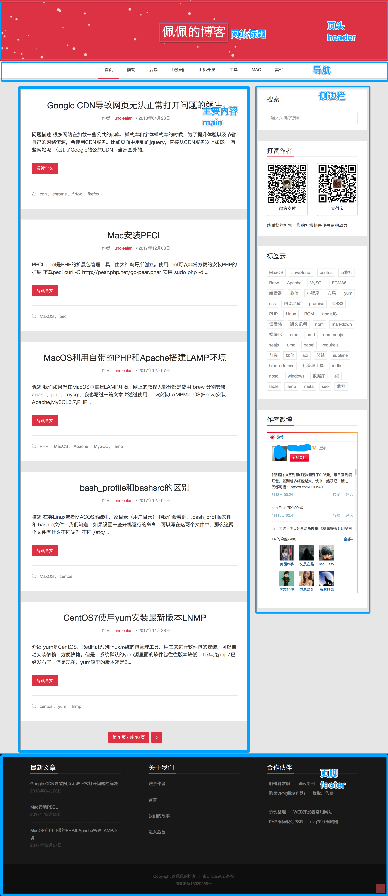
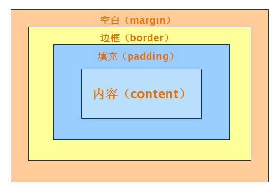
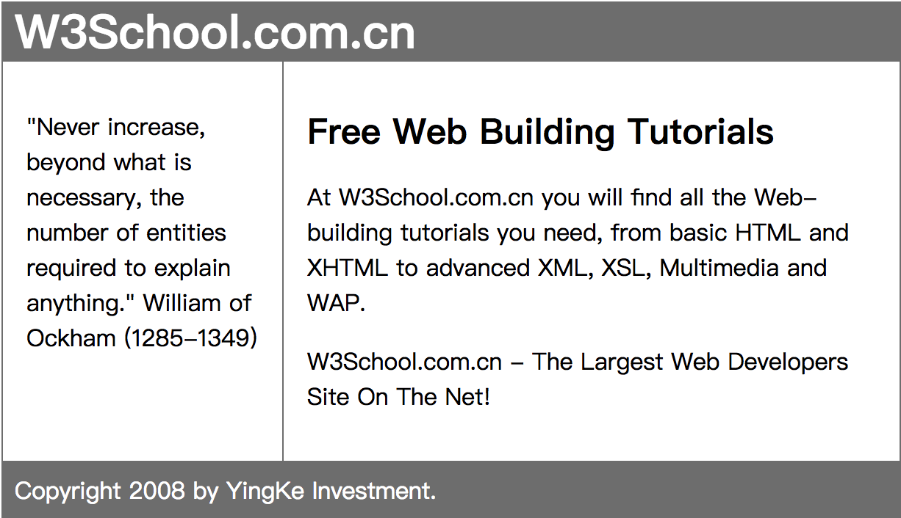
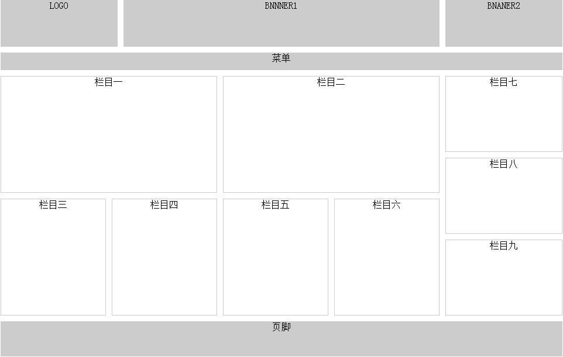

# 页面布局

## 1 页面组成



## 2 布局相关的标签

* `<div></div>`  定义文档中的分区或节
* `<span></span>`  这是一个行内元素，没有任何意义
* `<header></header>` **HTML5新增** 定义 section 或 page 的页眉
* `<footer></footer>` **HTML5新增** 定义 section 或 page 的页脚
*  `<main></main>` **HTML5新增**  标签规定文档的主要内容。`<main>` 元素中的内容对于文档来说应当是唯一的。它不应包含在  文档中重复出现的内容，比如侧栏、导航栏、版权信息、站点标志或搜索表单。IE都不识别
* `<nav></nav>`  **HTML5新增** 表示链接导航部分  如果文档中有“前后”按钮，则应该把它放到 <nav> 元素中
* `<section></section>`  **HTML5新增** 定义文档中的节 通常不推荐那些没有标题的内容使用section
* `<article></article>`  **HTML5新增** 定义文章  论坛帖子 报纸文章 博客条目 用户评论
* `<aside></aside>` **HTML5新增** 相关内容，相关辅助信息，如侧边栏

## 3 盒子模型

### 3.1 什么是盒子模型

所有HTML元素可以看作盒子，在CSS中，"box model"这一术语是用来设计和布局时使用。

CSS盒模型本质上是一个盒子，封装周围的HTML元素，它包括：边距，边框，填充，和实际内容。

盒模型允许我们在其它元素和周围元素边框之间的空间放置元素。



* **Margin\(外边距\)**  清除边框外的区域，外边距是透明的。

* **Border\(边框\)**  围绕在内边距和内容外的边框。

* **Padding\(内边距\)**  清除内容周围的区域，内边距是透明的。

* **Content\(内容\)**  盒子的内容，显示文本和图像。

  

### 3.2 块级元素和内联元素(行内元素)

#### 块级元素

* **总是在新行上开始，占据一整行**；			
* 高度，行高以及外边距和内边距都可控制；		
* 宽度缺省是它的容器的100%，除非设定一个宽度	
* 它可以容纳内联元素和其他块元素。			

#### 内联元素

* **和其他元素都在一行上**；				
* 高，行高及外边距和内边距部分可改变；		
* 宽度只与内容有关；					
* 行内元素只能容纳文本或者其他行内元素。		
* 外边界只能对左右起作用，内边距都起作用		

#### 块级元素和内联元素的转换

```css
display: block | inline | inline-block
```


  

### 3.2 盒子模型之间的关系

#### document树

父元素  子元素   后代元素   祖先元素  兄弟元素 

#### 标准文档流			 

1. 行内元素不占据单独的空间，依附于块级元素，行内元素没有自己的区域。它同样是DOM树中的一个节点，在这一点上行内元素和块级元素是没有区别的。

2. 块级元素总是以块的形式表现出来，并且跟同级的兄弟块依次竖直排列，左右自动伸展，直到包含它的元素的边界，在水平方向不能并排。

#### 盒子在标准流中的定位原则

* 行内元素之间的水平margin				
* 块级元素之间的竖直margin  (margin的塌陷)		
* 嵌套盒子之间的margin, (子元素父元素margin合并)	
* 将margin设置为负值					


### 3.3 盒子模型相关CSS属性

#### 布局属性

* display
  ```

  | 值           | 描述                                                 |
  | ------------ | ---------------------------------------------------- |
  | none         | 此元素不会被显示。                                   |
  | block        | 此元素将显示为块级元素，此元素前后会带有换行符。     |
  | inline       | 默认。此元素会被显示为内联元素，元素前后没有换行符。 |
  | inline-block | 行内块元素。（CSS2.1 新增的值）                      |
  ```

* float
  ```
  | 值      | 描述                                                 |
  | ------- | ---------------------------------------------------- |
  | left    | 元素向左浮动。                                       |
  | right   | 元素向右浮动。                                       |
  | none    | 默认值。元素不浮动，并会显示在其在文本中出现的位置。 |
  | inherit | 规定应该从父元素继承 float 属性的值。                |
  ```

* clear
  ```

  | 值      | 描述                                  |
  | ------- | ------------------------------------- |
  | left    | 在左侧不允许浮动元素。                |
  | right   | 在右侧不允许浮动元素。                |
  | both    | 在左右两侧均不允许浮动元素。          |
  | none    | 默认值。允许浮动元素出现在两侧。      |
  | inherit | 规定应该从父元素继承 clear 属性的值。 |
  ```

* visibility	  
  ```   

  | 值       | 描述                                                         |
  | -------- | ------------------------------------------------------------ |
  | visible  | 默认值。元素是可见的。                                       |
  | hidden   | 元素是不可见的。                                             |
  | collapse | 当在表格元素中使用时，此值可删除一行或一列，但是它不会影响表格的布局。被行或列占据的空间会留给其他内容使用。如果此值被用在其他的元素上，会呈现为 "hidden"。 |
  | inherit  | 规定应该从父元素继承 visibility 属性的值。                   |
  ```

* overflow	 
  ```  

  | 值      | 描述                                                     |
  | ------- | -------------------------------------------------------- |
  | visible | 默认值。内容不会被修剪，会呈现在元素框之外。             |
  | hidden  | 内容会被修剪，并且其余内容是不可见的。                   |
  | scroll  | 内容会被修剪，但是浏览器会显示滚动条以便查看其余的内容。 |
  | auto    | 如果内容被修剪，则浏览器会显示滚动条以便查看其余的内容。 |
  | inherit | 规定应该从父元素继承 overflow 属性的值。                 |
  ```

* overflow-x	

* overflow-y	

#### 尺寸

* width / max-width / min-width
* height / max-height / min-height

#### 内补白

* padding / padding-left / padding-right / padding-top / padding-bottom

#### 外边距

* margin		
* margin-left	
* margin-right	
* margin-top	
* margin-bottom


## 4 浮动

### 4.1 什么是浮动

* CSS的Float(浮动)，元素可以围绕其他元素向左或向右被推动
* 设置浮动，脱离普通文档流
* 浮动元素都会变为块级元素
* 如果不设置宽度，会尽可能的窄
* 浮动元素之后的元素将围绕它 浮动元素之前的元素将不会受到影响。

### 4.2 设置浮动

```css
.item {
    float:left
}
.item {
    float:right
}
/*float 属性的默认值是 none  表示没有浮动*/
```

### 4.3 清除浮动

浮动框旁边的行框被缩短，从而给浮动框留出空间，行框围绕浮动框。

因此，创建浮动框可以使文本围绕图像：


要想阻止行框围绕浮动框，需要对该框应用 clear 属性。clear 属性的值可以是 left、right、both 或 none，它表示框的哪些边不应该挨着浮动框。

```css
clear: both
clear: left
clear: right
```

### 4.4 浮动实验

实现以下实现

1. 设置第一浮动的div

2. 设置第2个浮动div

3. 设置第3个浮动div

4. 改变第三个浮动方向

5. 改变第二个浮动方向

6. 全部向左浮动,增加第一个的高度

7. 使用clear属性清楚浮动的影响

8. 扩展盒子的高度 (元素高度和浮动的元素)

9. 段落首字母浮动

10. 图片浮动

11. 简单浮动布局

    


### 4.5 浮动相关CSS属性总结

* float   值: none(默认) /left /right
* clear  值: none(默认) /both /left /right


### 4.6 浮动布局小案例




## 5 定位

### 5.1 相对定位

* 使用相对定位的盒子,会相对于它原来的位置,通过偏移指定的距离,到达新的位置
* 使用相对定位的盒子,仍在标准流中,它对父块好兄弟盒子没有任何影响

```css
.box {
    position: relative;
    top: 10px;
    left: 20px;
}
```


### 5.2 绝对定位

* 使用绝对定位的盒子以它"最近"的一个"已经定位"的"祖先元素"为基准进行偏移. 如果没有已经定位的"祖先元素", 那么会以浏览器窗口为基准进行定位
* 绝对定位的框从标准流中脱离,这意味着它们对其后的兄弟盒子的定位没有影响,其他的盒子就好像这个盒子不存在一样

```css
.box {
    position: absolute;
    top: 10px;
    left: 20px
}
```


### 5.3 固定定位 

以浏览器窗口为基准
窗口滚动时,依然保持位置不变

```css
.box {
    position: fixed;
    top: 10px;
    left: 20px;
}
```


### 5.4 空间位置

* 使用css属性 `z-index`设置元素的堆叠顺序。拥有更高堆叠顺序的元素总是会处于堆叠顺序较低的元素的前面。
* z-index 仅能在定位元素上奏效


### 5.5 定位相关CSS属性总结

* position	static(默认值) /relative /position /fixed
* top		
* left		
* right		
* bottom		
* z-index	auto(默认值)/数字


## 6 浏览器兼容性

### 6.1 浏览器分类

#### 主流浏览器(原生浏览器)

拥有独立内核的浏览器 被称为主流浏览器

* chrome   内核 blink   早期的chrome使用apple的开源内核 webkit. 我们依然习惯上称呼chrome的内核为webkit
* safari       内核 webkit  
* IE              内核 Trident
* Firfox       内核 Gecko
* Opera      v12.17以前采用 Presto 内核。后来紧跟chrome的步伐，使用chrome的内核 成为了壳浏览器

#### 壳浏览器

在某浏览器内核之上增加相应的辅助功能，并改变其名称与外观的浏览器

opera、360安全、360极速、UC、搜狗、猎豹、QQ浏览器、2345浏览器、淘宝浏览器 等


### 6.2 浏览器对HTML5和CSS3的兼容性情况

* HTML5需要 IE9以及以上版本的IE浏览器支持
* CSS3不同的模块对浏览器的兼容程度各不相同。 对于IE浏览器，肯定需要IE9以及以上的浏览器支持
* chrome、firefox浏览器一般都会自动更新，所以兼容性特别棒！
* 手机浏览器，大多使用webkit内核，兼容性较好。关键是 手机上没有IE！
* 目前的国产浏览器，多采用双内核，使用chrome内核的时候兼容性较好


### 6.3 兼容技巧

#### 设置IE使用最新的渲染引擎

```html
<meta http-equiv="X-UA-Compatible" content="IE=Edge">
```

#### 让双核浏览器默认使用webkit内核	 

```html
<meta name="renderer" content="webkit"> 
```

#### 让IE8识别HTML5新增标签

```html
<!--[if lt IE 9]>
    <script src="/html5shiv/dist/html5shiv.js"></script>
<![endif]-->
```


